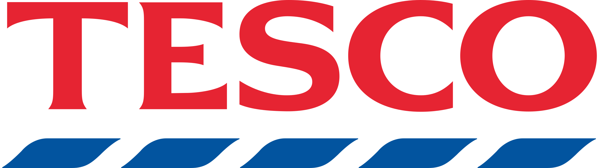
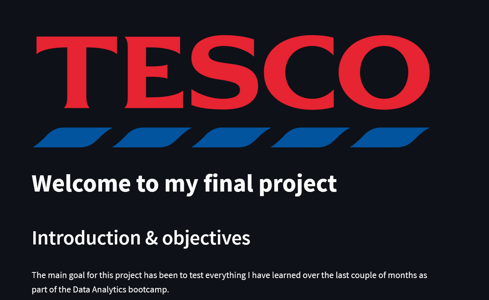
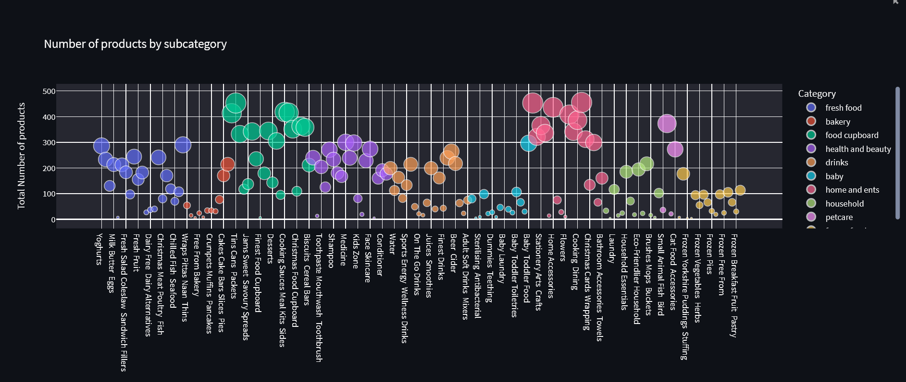
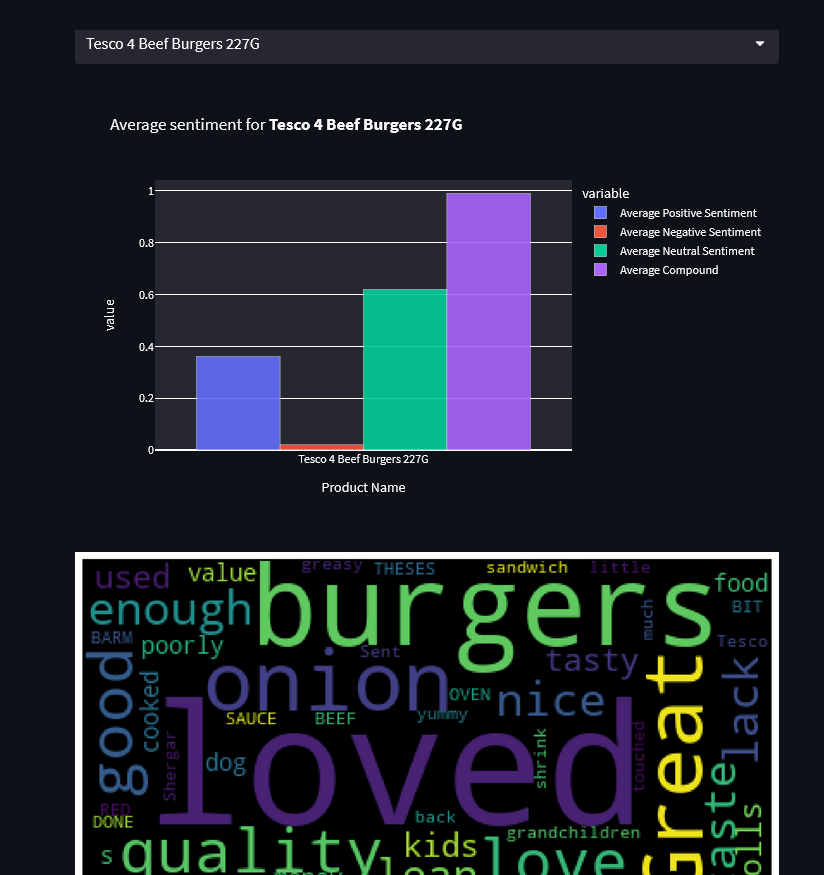

# Final Project: UK Supermarket Analysis

### Objectives

The main goal for this project has been to test everything I have learned over the last couple of months as part of the Data Analytics bootcamp.

Therefore, and given my previous background in Fast Moving Consumer Gooods (FMCG), I thought it would be a great idea to _**have a dashboard that would easily help me (a consumer/user) get all the public information across the British supermarkets**_ in order to decide whether I should buy a given product/category/brand in a supermarket or another.

Given the main goal above, the objectives for this project are:

1) Start with Tesco (UK market leader) as the first component of this dashboard to test whether it works as expected.

2) Web scraping from Tesco's website so I could get:
    a) Product name, price, category, promotions, etc.
    b) GDA (Guideline Daily Amounts) information & product reviews given by customers, where applicable.
    c) Sentiment Analysis of a given product/category/brand

3) Deep dive analysis of Tesco's brands, categories & subcategories within different scenarios: stock issues, promotions, innovation, etc.

4) Offer users (and myself) a dashboard to easily access all this information without having to navigate through their website.

The following screenshots have been taken from the Streamlit app to show how it actually looks:

### Key steps taken for this project

- Information gathering from Tesco's website via web scraping: getting main product information, brand information, manufacturers location in different stages given the considerable amount of time it takes to web scrape it.

- Creation of five different databases - through Pandas - depending on the information I want / need to see.

- SQL database creating with five different relational tables via common primary keys.

- Creation of a Streamlit app to self serve data in a dashboard format (which is running SQL queries in the background).

### How to access the information

For now, this information is only hosted locally through Streamlit, however it will eventually be available to access online. 

### Conclusions & Next Steps

Now that we can see the analysis for Tesco works and that you can get different insights depending on the information you select, the idea would be to do the following:

1) Extend the analysis to the key British supermarket chains in order to get a comparison by category/brand.

2) Weekly update of this analysis so historical data can be gathered as well as price predictions can be calculated given the historical.

3) Add GDA (aka nutritional values of the products) to the analysis to get a better understanding of how much these relate to price & promotions and what impact the new HFSS (High in Fat, Salt & Sugar) legislation on food products is going to have across the market.

